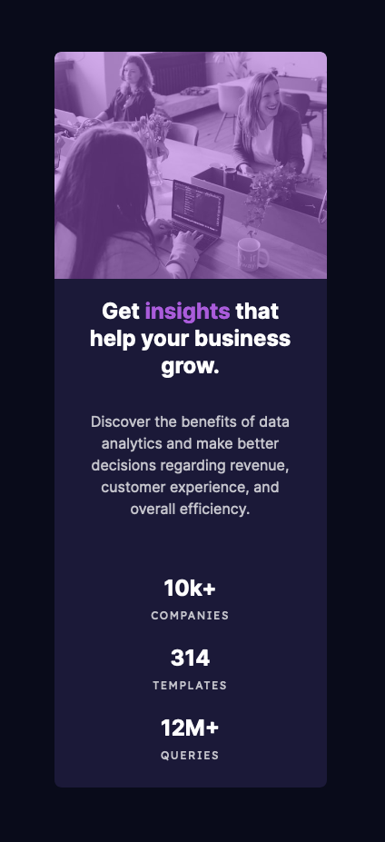

# Frontend Mentor - Stats preview card component solution

This is a solution to the [Stats preview card component challenge on Frontend Mentor](https://www.frontendmentor.io/challenges/stats-preview-card-component-8JqbgoU62). Frontend Mentor challenges help you improve your coding skills by building realistic projects. 

## Table of contents

- [Overview](#overview)
  - [The challenge](#the-challenge)
  - [Screenshot](#screenshot)
  - [Links](#links)
- [My process](#my-process)
  - [Built with](#built-with)
  - [What I learned](#what-i-learned)
  - [Continued development](#continued-development)
  - [Useful resources](#useful-resources)
- [Author](#author)


## Overview

My first attempt at creating a card component without learning from a tutorial online. Overall I'm happy with how eveything came out. There are a few small differences that I noticed from mine and the original that I was using as an example. The first being the accent added to the image. I couldn't quite figure out how to get the same filter result as the given example, but it's still relatively close to what I wanted. The other noticable difference is the font weight on some of the text. I tried changing the font weight however it would not get thinner.

### The challenge

Users should be able to:

- View the optimal layout depending on their device's screen size

### Screenshot





### Links

- Live Site URL: [live site URL](https://card-component1.netlify.app/)

## My process
I first started off with the html by dividing everything into the appropriate containers and class names. For this card component, I started off with a section to contain the card so I can center it on the page. I then created the card component with two div children, one for the text info and the other for the image. I then also gave the text another three div children for the stats.
Once html was done, I moved into creating the necessary sass files and placing them in the appropriate styles folder that I created. I split the global parameters into one file and the rest in the style.scss file.
Once I actually began styling, I started with the desktop view and worked my way into the mobile view. I ran into a couple of hurdles throughout the process as I needed to relearn how to do specific things (ex. parameters with flexbox or dynamic sizing).
Overall, it took me a couple of hours to finish which I know is probably really long to just finish a card component, but over time I know I can improve.

### Built with

- Semantic HTML5 markup
- CSS custom properties
- SASS
- Flexbox
- Desktop-first workflow

### What I learned

Going from nothing but tutorials to creating something on your own is definitely challenging for the first time. I had already forgotten quite a few simple but important things like adding a width and height to the image so it covers the entire half of the card for example. Here are some examples of scss I didn't quite know how to use until googling it:
```scss
h3 {
  font-size: calc(1.5em + 1vw) //dynamic font size
}

@mixin flex($justify, $align, $direction) { //creating a mixin for use with flexbox
  display: flex;
  justify-content: $justify;
  align-items: $align;
  flex-direction: $direction;
}

.card-image::before { //creating a psuedo element to add the accent filter on the image
  content: "";
  position: absolute;
  top: 0;
  bottom: 0;
  left: 0;
  right: 0;
  background: rgba(170, 92, 219, 0.5);
}
```

### Continued development

I definitely still need to continue just working on the fundementals to make sure I'm solid on the simple things and get the workflow going quicker. Since this was an easy challenge it didn't have any animations or transitions but I know that I'll need to work on those as well as well as working with psuedo elements.

### Useful resources

Don't have any specifc resources to give this time around.

## Author

- Website - [Alfonso Pruneda](https://alfonsopruneda.netlify.app)
- Frontend Mentor - [@915fonzie](https://www.frontendmentor.io/profile/915fonzie)
- Twitter - [@915fonzie](https://www.twitter.com/915fonzie)

